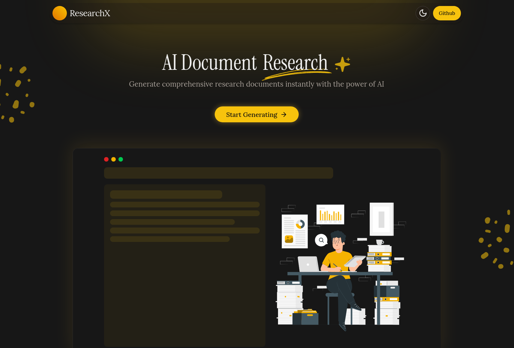

# ResearchX ✨📚 - AI-Powered Document Research Generator



Generate comprehensive research documents instantly with the power of AI. Whether you're a student, researcher, or professional, ResearchX simplifies the research process and saves you time.

## ✨ Features

- 🧠 **AI-Powered Research** - Generate comprehensive research documents using cutting-edge AI models
- 📝 **Customizable Outlines** - Create and edit document outlines to match your specific research needs
- 🎯 **Academic Precision** - Tailor content to different academic levels from high school to doctoral
- 📊 **Multiple Export Formats** - Export your research as DOCX or PDF with proper formatting
- 🌓 **Dark/Light Mode** - Comfortable viewing experience in any lighting condition
- 🚀 **Built with Next.js 15** - Utilizing the latest web technologies for optimal performance

## 🛠️ Tech Stack

- **Framework**: [Next.js 15](https://nextjs.org/) with App Router
- **Styling**: [Tailwind CSS v4](https://tailwindcss.com/) for utility-first styling
- **UI Components**: [Shadcn UI](https://ui.shadcn.com/) for beautiful, accessible components
- **AI Integration**: [AI SDK](https://sdk.vercel.ai/docs) with Google Gemini models
- **Animations**: [Motion](https://motion.dev/) for smooth transitions
- **Document Generation**: DOCX and PDF export capabilities

## 🚀 Getting Started

### Prerequisites

- Node.js (v18 or newer)
- npm, yarn, or bun

### Installation

1. Clone the repository:

   ```bash
   git clone https://github.com/Xeven777/ai-research.git
   cd ai-research
   ```

2. Install dependencies:

   ```bash
   npm install
   # or
   yarn install
   # or
   bun install
   ```

3. Create a `.env.local` file in the root directory with your API keys:

   ```
   GOOGLE_GENERATIVE_AI_API_KEY=your_google_api_key
   ```

4. Start the development server:

   ```bash
   npm run dev
   # or
   yarn dev
   # or
   bun dev
   ```

5. Open [http://localhost:3000](http://localhost:3000) in your browser to see the application.

## 📋 How It Works

1. **Enter Research Parameters** - Specify your topic, academic level, and document length
2. **Review & Customize Outline** - Edit the AI-generated outline to fit your needs
3. **Generate Content** - Let AI create detailed content for each section
4. **Preview & Export** - Review the final document and export in your preferred format

## 🤝 Contributing

Contributions are welcome! Feel free to open issues or submit pull requests to help improve ResearchX.

## 📄 License

This project is licensed under the MIT License - see the LICENSE file for details.

## 👤 Contact

Created by [Anish Biswas](https://github.com/Xeven777) - Feel free to reach out on [LinkedIn](https://www.linkedin.com/in/anishbiswas777/)!

---

<div align="center">
  <p>⭐ Star this repository if you find it useful! ⭐</p>
  <p>Made with ❤️ using Next.js and AI</p>
</div>
